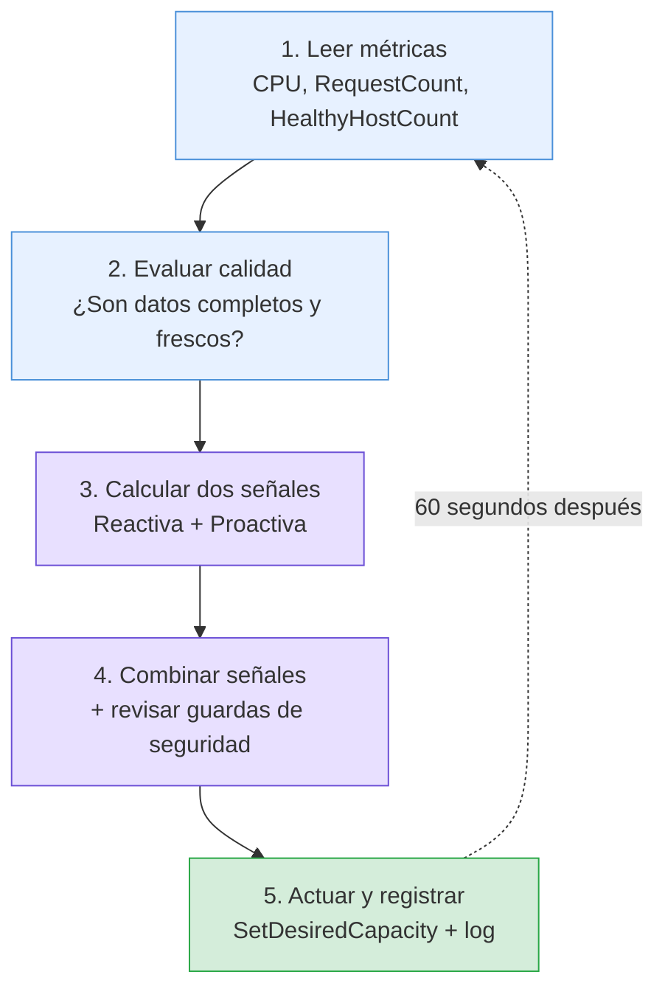
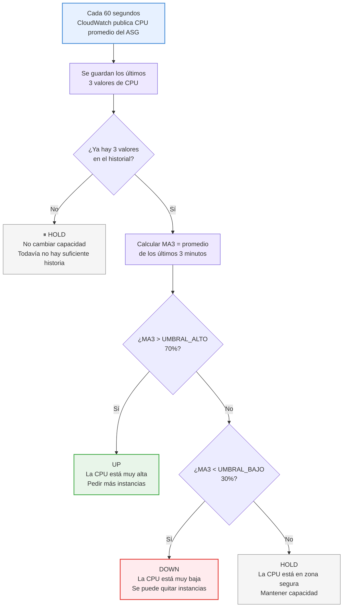
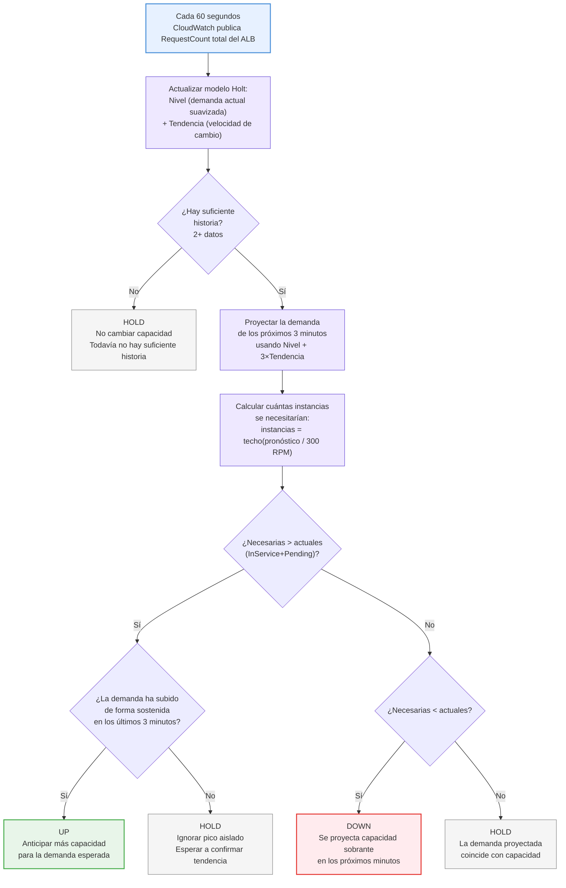
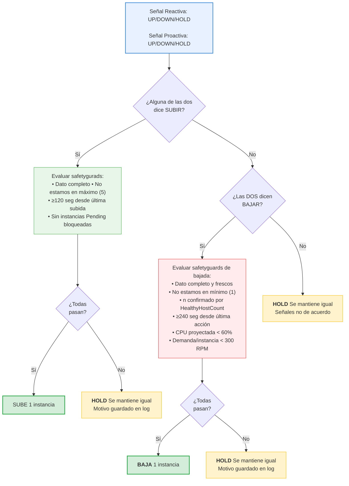

# Auto-Scaling Controller en C++ para AWS

Controlador de autoescalado horizontal en C++ para ejecutarse como un proceso continuo en una única instancia EC2. Implementa un ciclo de decisión híbrido reactivo-proactivo: observa métricas de CloudWatch, combina una política basada en umbrales de CPU con un pronóstico de demanda mediante suavizado de Holt, y ajusta la capacidad del ASG en consecuencia

---

## Tabla de contenidos

1. [Requisitos previos](#requisitos-previos)
2. [Quick start: compilar y ejecutar](#quick-start-compilar-y-ejecutar)
3. [Estructura del repositorio](#estructura-del-repositorio)
4. [Configuración](#configuración)
5. [Cómo decide el controller](#cómo-decide-el-controller)
6. [Métricas de CloudWatch](#métricas-de-cloudwatch)
7. [Cómo leer el log de decisiones](#cómo-leer-el-log-de-decisiones)
8. [Documentación adicional](#documentación-adicional)
9. [Diagramas de arquitectura](#diagramas-de-arquitectura)

---

## Requisitos previos

### En la máquina (compilación)

- **CMake** ≥ 3.13
- **C++17** (g++ o clang)
- **vcpkg** (package manager de C++): [Instalar](https://github.com/Microsoft/vcpkg)
- **AWS SDK for C++** (se instala vía vcpkg): `monitoring` + `autoscaling`

### En AWS

- **VPC** con subredes públicas y privadas
- **Application Load Balancer (ALB)** con Target Group que apunta a las instancias del ASG
- **Auto Scaling Group (ASG)** con mín 1 y máx 5 instancias (configurables)
- **AMI personalizada** con app Flask (ver [Construcción de la AMI](#construcción-de-la-ami))
- **EC2 para el controller** con rol IAM que permita CloudWatch + Auto Scaling (ver `docs/iam-policy-controller.json`)
- **Región:** `us-east-1` (configurable en `controller.env`)

---

## Quick start: compilar y ejecutar

### 1. Clonar y navegar

```bash
git clone <repo-url>
cd controller
```

### 2. Instalar dependencias 

```bash
# Instalar vcpkg 
git clone https://github.com/Microsoft/vcpkg.git
./vcpkg/bootstrap-vcpkg.sh

# Instalar dependencias del proyecto
./vcpkg/vcpkg install aws-sdk-cpp[monitoring,autoscaling]:x64-linux
```

### 3. Compilar

```bash
mkdir build && cd build
cmake .. -DCMAKE_TOOLCHAIN_FILE=../vcpkg/scripts/buildsystems/vcpkg.cmake
cmake --build . -j4
cd ..
```

### 4. Configurar variables de entorno

```bash
cp config/controller.env.example config/controller.env
# Edita config/controller.env con los valores reales de tu cuenta AWS:
#   - ASG_NAME
#   - REGION
#   - LOAD_BALANCER_DIM
#   - TARGET_GROUP_DIM
```

### 5. Ejecutar

```bash
set -a; source config/controller.env; set +a
./build/controller
```

El controller entra en un bucle infinito: cada 30 segundos consulta CloudWatch, y cada 60 segundos toma una decisión. Escribe sus logs en `logs/decisions.jsonl`.

---


## Configuración

Todas las variables están en `config/controller.env.example` (defaults) y se cargan de `config/controller.env` (que NO se versiona).

### Variables obligatorias (sin default)

| Variable | Ejemplo | Significado |
|---|---|---|
| `ASG_NAME` | `ASG-App` | Nombre del Auto Scaling Group |
| `REGION` | `us-east-1` | Región AWS |
| `LOAD_BALANCER_DIM` | `app/MI-ALB/abc123def456` | Dimensión del ALB en CloudWatch |
| `TARGET_GROUP_DIM` | `targetgroup/MI-TG/xyz789abc123` | Dimensión del Target Group en CloudWatch |

### Variables de decisión 

| Variable | Default | Rango | Significado |
|---|---|---|---|
| `UMBRAL_ALTO` | 70.0 | 0-100 | CPU (%) → subir |
| `UMBRAL_BAJO` | 30.0 | 0-100 | CPU (%) → bajar |
| `MARGEN_BAJADA` | 10.0 | 0-100 | Holgura del chequeo n-1 |
| `MA_VENTANA` | 3 | ≥1 | Muestras para media móvil de CPU |
| `HOLT_ALPHA` | 0.5 | 0-1 | Respuesta rápida del nivel en Holt |
| `HOLT_BETA` | 0.3 | 0-1 | Respuesta lenta de la tendencia en Holt |
| `HORIZONTE_PERIODOS` | 3 | ≥1 | Minutos adelante que predice Holt |
| `C_RPM` | 300.0 | >0 | Capacidad de 1 instancia (req/min) |
| `MIN_CAPACITY` | 1 | ≥1 | Mínimo de instancias |
| `MAX_CAPACITY` | 5 | ≥1 | Máximo de instancias |

---

## Cómo decide el controller

### Decision Engine

El **Decision Engine** orquesta un ciclo completo cada 60 segundos:

1. **Leer métricas** de CloudWatch (CPU, RequestCount, HealthyHostCount)
2. **Evaluar calidad** (¿datos completos y frescos?)
3. **Calcular dos señales independientes** (reactiva y proactiva)
4. **Combinar señales** (OR para subir, AND para bajar)
5. **Aplicar guardas de seguridad** (cooldowns, límites, chequeo n-1)
6. **Ejecutar SetDesiredCapacity** si corresponde
7. **Registrar la decisión** en el log JSONL

### Señal Reactiva 

Responde a la **carga actual medida ahora**. Lee la CPU promedio del ASG de los últimos 3 minutos (media móvil de 3 muestras) y compara contra umbrales fijos: sube si MA_CPU > 70%, baja si MA_CPU < 30%, mantiene en cualquier otro caso. Es simple, rápida y defensiva: reacciona a picos reales. La media móvil filtra ruido de 1 minuto.

### Señal Proactiva 

Anticipa la **carga futura esperada**. Usa Holt (double exponential smoothing) para aprender la tendencia del RequestCount total y proyecta la demanda 3 minutos adelante. Traduce ese pronóstico a instancias necesarias (pronóstico / 300 RPM por instancia). Emite UP si la demanda crecerá, pero solo si ese aumento es sostenido (últimos 3 minutos en tendencia creciente: evita picos aislados). Emite DOWN si detecta descenso sostenido de demanda.

---

## Métricas de CloudWatch

| Métrica | Namespace | Dimensión | Stat | Período | Uso |
|---|---|---|---|---|---|
| `CPUUtilization` | `AWS/EC2` | `AutoScalingGroupName` | Average | 60s | Señal reactiva |
| `RequestCount` | `AWS/ApplicationELB` | `LoadBalancer` | Sum | 60s | Señal proactiva (Holt) |
| `HealthyHostCount` | `AWS/ApplicationELB` | `LoadBalancer` + `TargetGroup` | Average | 60s | Confirmación de capacidad real |

---


## Documentación adicional

### Dentro del repo

- **`infra/app/app.py`**: App Flask que corre en las instancias del ASG (genera carga y health endpoint)
- **`infra/app/app.service`**: Systemd para la app
- **`infra/controller.service`**: Systemd para el controller
- **`docs/iam-policy-controller.json`**: Política IAM recomendada (reemplazar REGION/ACCOUNT_ID)
- **`loadtest/scenarios/escenario_completo.csv`**: Perfil de carga: 7 fases (base, pico, recuperación, rampa, meseta, bajada, reposo)

---

## Diagramas de arquitectura

### Flujo del ciclo de control



### Señal Reactiva



### Señal Proactiva (Holt)



### Combinación de señales y safetyguards



---

## Construcción de la AMI

La app de las instancias del ASG se crea una sola vez en una **AMI propia** (`ami-autoscaling-app-v1`), evitando que cada instancia tenga que instalar dependencias en el arranque.

### Procedimiento

1. Lanzar instancia temporal: Ubuntu 24.04 LTS, t2.micro, en una subred pública
2. Conectar por SSH y ejecutar:
   ```bash
   sudo apt update && sudo apt install -y python3-flask
   ```
3. Copiar archivos:
   ```bash
   sudo mkdir -p /opt/app
   sudo cp infra/app/app.py /opt/app/app.py
   sudo cp infra/app/app.service /etc/systemd/system/app.service
   ```
4. Habilitar y arrancar:
   ```bash
   sudo systemctl daemon-reload
   sudo systemctl enable --now app
   ```
5. Verificar:
   ```bash
   curl http://localhost/health    # → "ok"
   curl http://localhost/          # → "ok {número}" (genera CPU)
   ```
6. Prueba de persistencia (reiniciar sin volver a entrar por SSH):
   ```bash
   sudo reboot
   # Desde fuera: curl http://<ip-publica>/health → confirma que arranca solo
   ```
7. Limpiar y crear imagen:
   ```bash
   sudo apt clean
   ```

---
